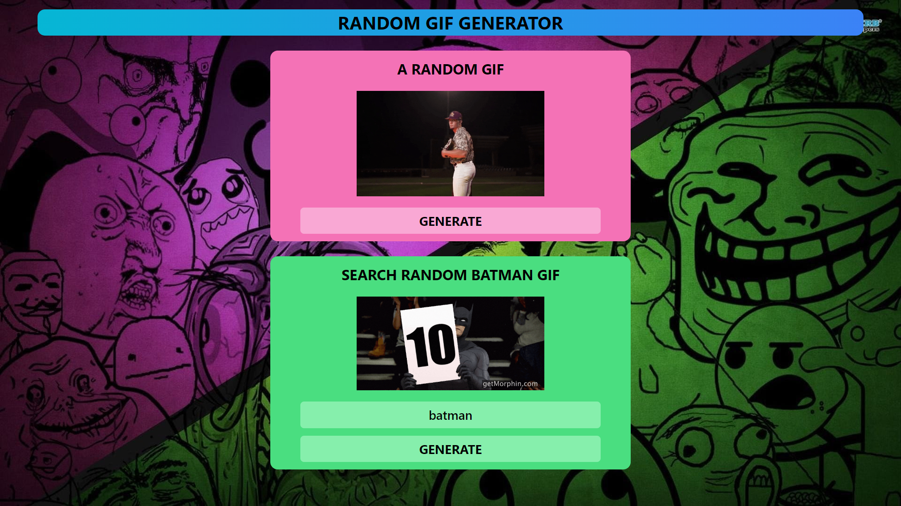

# 🚀 Random GIF Generator App 🤣

Welcome to the Random GIF Generator app! This dynamic React application brings humor to your fingertips, allowing you to generate hilarious GIFs or memes in two exciting ways. 🎉

## 🌐 Click on the Image 

<a href="https://omraj0.github.io/Weather-App/"></a>

## 📋 Features

✨ Here are some exciting features of the Random Meme Generator:

- 🤪 **Random GIFs**: Click the "Generate" button, and watch as a new meme appears with every click.
- 🖼️ **Category Selection**: Pick a GIF category of your choice, and click "Generate" to get GIFs from that category.
- 📤 **Share GIFs**: Share your favorite GIFs with friends and family on social media.
- 🔄 **Infinite Fun**: Keep clicking for endless GIF entertainment.

## 🚀 Quick Start

Getting started with the Random Meme Generator is a breeze:

1. Navigate to the directory where you want to store the project. You can use the `cd` command to change directories. For example, to navigate to your desktop, you can use:

   ```bash
   cd ~/Desktop
   ```

2. Clone the repository by running the following command. This will create a copy of the project on your computer:

   ```bash
   git clone https://github.com/omraj0/GIF_Generator.git
   ```

3. Once the repository is cloned, navigate to the project folder:

   ```bash
   cd GIF_Generator
   ```

4. **Install Dependencies:**

   ```bash
   npm install
   ```

5. **Start the App:**

   ```bash
   npm start
   ```

6. **Open Your Browser:**

   The app will be running at `http://localhost:3000`.

## 🎨 Customization

Feel free to customize the Random Meme Generator app to match your style and preferences:

- Modify the CSS in the `src/styles` folder to change the app's appearance.
- Add your favorite GIFs to the GIF library by following the data structure in `src/data/gif.js`.

## 🌐 Live Demo

Check out the live demo of the Random Meme Generator here: [Live Demo](https://omraj0.github.io/GIF_Generator/)

## 🤝 Contributing

If you have ideas to improve the Random Meme Generator, contributions are welcome! Fork the repository, create a new branch, and submit a pull request.

## 📞 Contact

If you have any questions or want to get in touch, feel free to reach out:

- Email: omraj010@gmail.com
- LinkedIn: [@Om Raj](https://www.linkedin.com/in/om-raj-915695228/)

Let the GIF-creating fun begin! Happy coding and meme-sharing! 😄🎉
